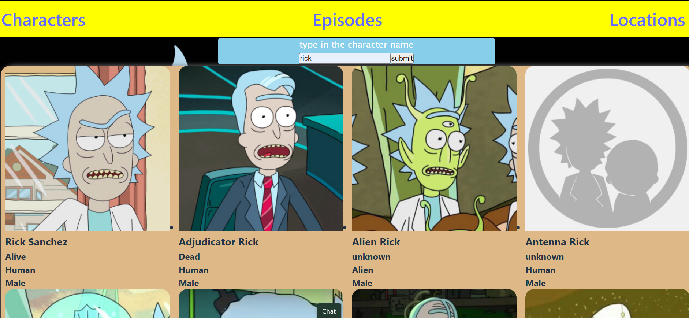

# React + Vite

RICK AND MORTY!!!!

This web application of Rick and Morty was made by using API in React.js
Also, HTML, CSS, and JS (jsx)

How to create a React.js App using Vite:
Open Visual Studio Code.
Make a new Directory (mkdir MOD2)
cd into the Directory (cd MOD2/)

steps:
-npm create vite@latest
-project-name: rick-and-morty
(go ahead and enter a name for your project)
-Select a framework: React
(This select a framework option allows you to select any front-end framwork in which you want Vite to run, in this case, React.)
-Select a variant: JavaScript
(Select a framework variant from the options, in this  case, Javascript)
cd into your new project name
-cd rick-and-morty
-npm install
-npm run dev
(Run your applicate to test if its working.)
This will then open up your localhost

I also installed the react-router-dom to be added into my dependencies
-npm instal react-router-dom

Unsolved Problems:
<!-- A LOT OF THEM!! -->

Deploy:
https://65694117e2501f3c65df4e59--golden-licorice-b44562.netlify.app/

This template provides a minimal setup to get React working in Vite with HMR and some ESLint rules.

Currently, two official plugins are available:

- [@vitejs/plugin-react](https://github.com/vitejs/vite-plugin-react/blob/main/packages/plugin-react/README.md) uses [Babel](https://babeljs.io/) for Fast Refresh
- [@vitejs/plugin-react-swc](https://github.com/vitejs/vite-plugin-react-swc) uses [SWC](https://swc.rs/) for Fast Refresh
